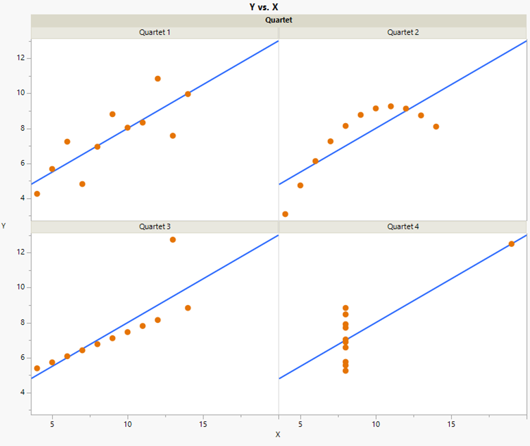
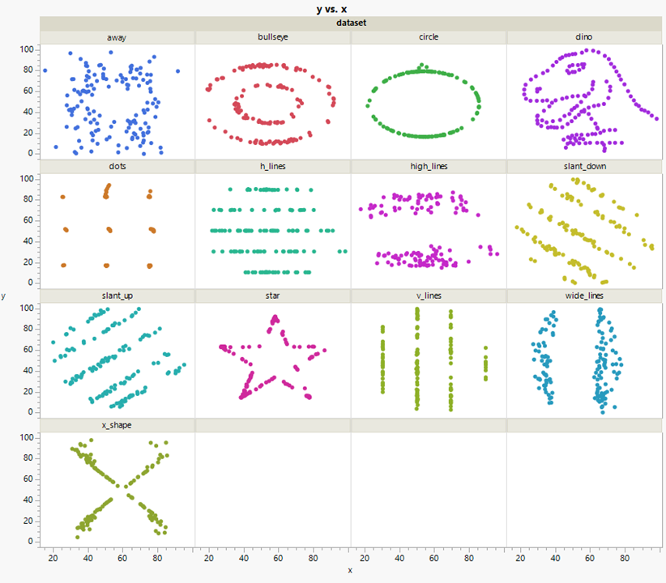
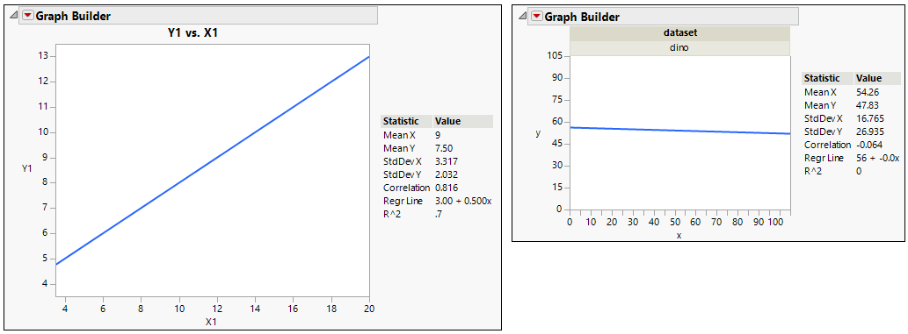
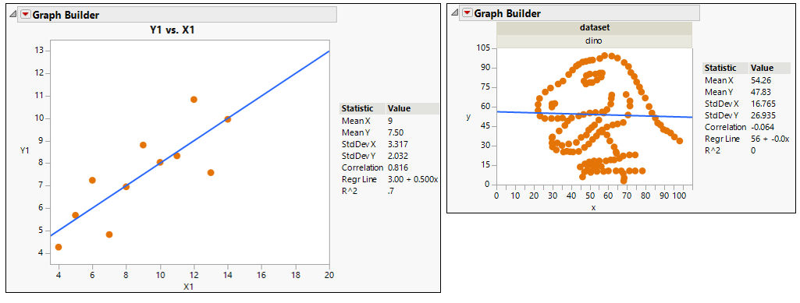
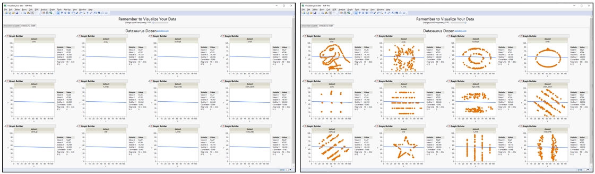

# visualize_your_data
Quick demo to demonstrate how important it is to visualize your data and not just trust descriptive statistics. Usable with JMP. This has also been posted to [JMP User Community - Remember to visualize your data](https://community.jmp.com/t5/Discussions/Remember-to-visualize-your-data/m-p/557745). JMP16 or newer is required to use the demo.

## Anscombe's Quartet
Anscombe's Quartet is a data set collection of four different data sets. These four data sets all have similar descriptive statistics, but different distributions and they are very different when plotted as scatterplot. This data set is commonly used to demonstrate the **importance of data visualization**.

Table below demonstrates the statistics which are similar to some decimal point (slighly modified from orignal as StdDev is used instead of variance).

_Anscombe's Quartete datasets descriptive statistics_
| Statistic  | Value |
| ------------- | ------------- |
| Mean X  | 9  |
| Mean Y  | 7.50  |
| StdDev X | 9  |
| StdDev Y | 7.50  |
| Correlation  | 9  |
| Regression Line  | 3.00 + 0.500 * x  |
| R^2  | 9  |

All the data sets have above statistics, but when they are plotted as using scatterplots, viewer can immediately see that the data sets are highly different. In the image below Anscombe's Quartet has been visualized using JMP's Graph Builder. Line was fit by using function `y = 3.00 + 0.5 * x`. 

_Anscombe's Quartet visualized using JMP's anscombe.jmp sample data set (Anscombe, 1973)_

## Datasaurus Dozen
Datasaurus dozen is a dataset generated by Matejka and Fitzmaurice (2017) to demonstrate that when exploring data it is important to visualize it. The work dicusses how such data sets can be created by using [simulated annealing](https://en.wikipedia.org/wiki/Simulated_annealing). Starting point for the Datasaurus Dozen dataset was _Datasaurus_ dataset created by Alberto Cairo which demonstrates not to trust summary statitics and **always visualize your data.**

More information on the simulation method can be read from either [autodesk's website](https://www.autodesk.com/research/publications/same-stats-different-graphs) (also includes code) or from [the paper](https://doi.org/10.1145/3025453.3025912).

Table below demonstrates the statistics which are similar to some decimal point. These are are more of an approximation (that's why statistics are marked with prefixed with ~).

_Datasaurus dozen summary statistics_
| Statistic  | Value |
| ------------- | ------------- |
| Mean X  | ~54.26  |
| Mean Y  | ~47.83  |
| StdDev X | 16.77  |
| StdDev Y | ~26.94  |
| Correlation  | ~-0.07  |
| Regression Line  | ~56 + -0.0x  |
| R^2  | 0  |

Even though the summary statistics for all the datasaurus dozen data sets are quite similar, same principle appears here as with Ancsombe's Quartet, when data is visualized, it is immediately clear that the data differs a lot. In the image below JMP's Graph Builder was used to visualize Datasaurus Dozen. 

_Datasaurus Dozen visualized with JMP's Graph Builder using using DatasaurusDozen.tsv._ Data downloaded from [Same Stats Different Graphs (autodesk.com)](https://www.autodesk.com/research/publications/same-stats-different-graphs)

## Demo
### Note
This script does require JMP16 or newer.

The _demo.jsl_ found from this repository will create user-interface with all the different data sets (Anscombe's and Datasaurus Dozen are separated to their own tabs). Then the script is run user will see only fitted lines and summary statistics for all data sets. User can then use slider box found from top of the window to increase the visibility of markers in the graphs.

The images below demonstate the usage of visiblity slider box on two of the graphs: Ancombes' Quartet 1 and Datasaurus Dozen's dino.

_Graph with markers invisible (Ancombe's Quartet 1 on left and Datasaurus Dozen's dino on right)_

_(Ancombe's Quartet 1 on left and Datasaurus Dozen's dino on right)_

The comparison should be done between different categories of datasets and that is where the demo is much more useful. Below is Datasaurus Dozen tab with markers hidden and then the image next to it shows them visible

_Datasaurus Dozen markers invisible on left and visible on right_

### Note
This github repository doesn't include the datasaurus dozen dataset as I'm not sure if I can freely use it. You can find the data from [Same Stats Different Graphs (autodesk.com)](https://www.autodesk.com/research/publications/same-stats-different-graphs) and then convert it to .jmp file easily. Save the dataset to datasets folder with name "DatasaurusDozen.jmp" and demo.jsl will automatically load it. If the file isn't find it will ask you to pick the file location.

Alternatively you can use the .zip file found from JMP community to run the tool [Remember to visualize your data](https://community.jmp.com/t5/Discussions/Remember-to-visualize-your-data/m-p/557745). 

## Sources
* Anscombe, F. J. (1973). Graphs in Statistical Analysis. American Statistician. 27 (1): 17–21.
* Matejka, J. and Fitzmaurice, G. 2017. Same stats, different graphs: generating datasets with varied appearance and identical statistics through simulated annealing. In Proceedings of the 2017 CHI conference on human factors in computing systems (pp. 1290-1294). Cited: 2022-10-19. Available: https://doi.org/10.1145/3025453.3025912
* Matejka, J. and Fitzmaurice, G. Same Stats Different Graphs. Cited: 2022-10-19. Available: https://www.autodesk.com/research/publications/same-stats-different-graphs